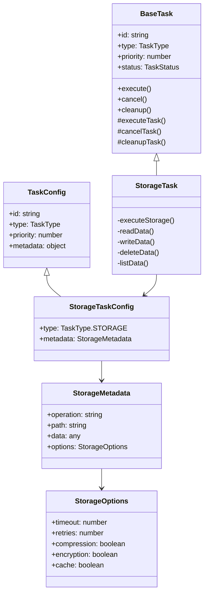
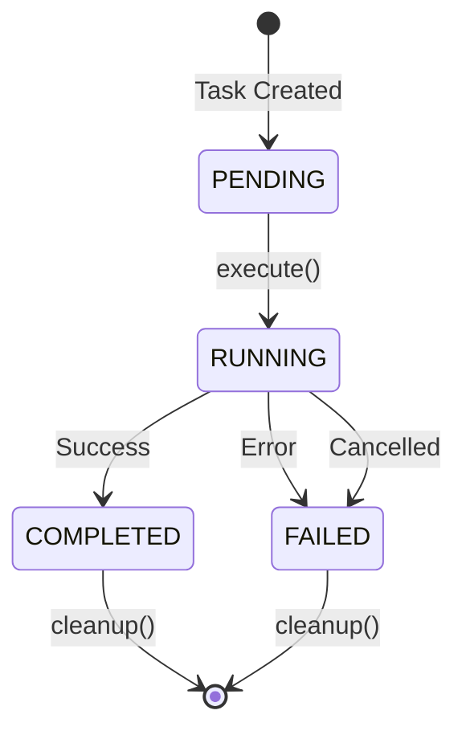
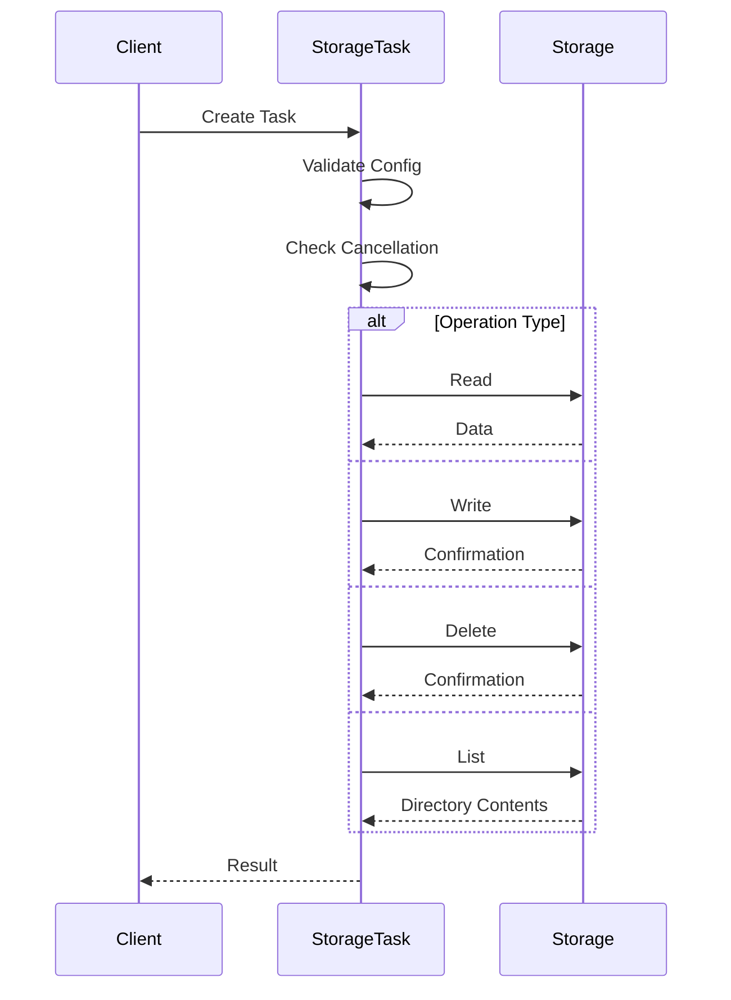
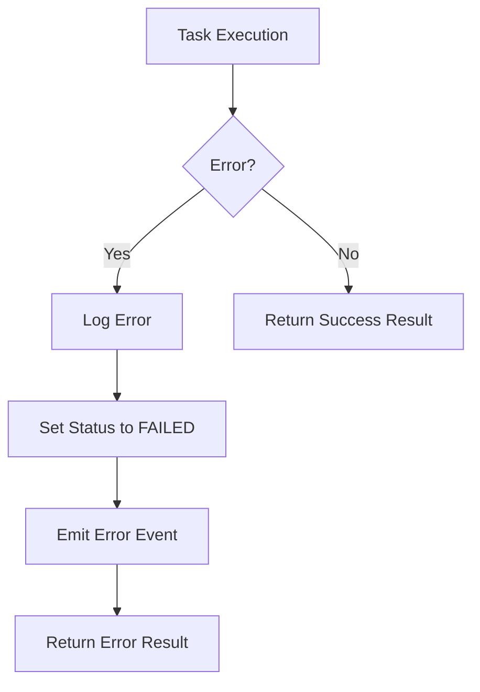
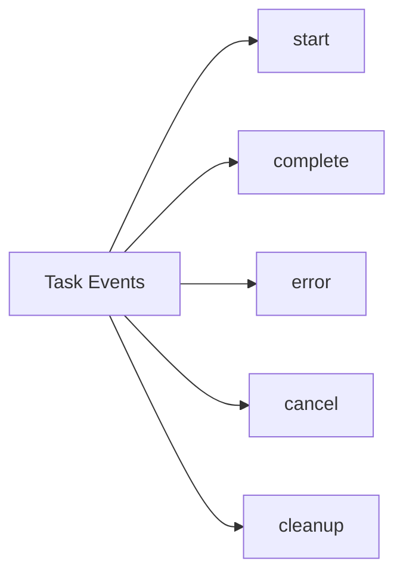

# Task System Documentation

## Overview

The task system provides a robust framework for executing various types of operations in the orchestrator. This documentation focuses on the storage task implementation, which handles data storage operations.

## Architecture



## Task Lifecycle



## Storage Operations Flow



## Error Handling



## Configuration

### StorageTaskConfig

```typescript
interface StorageTaskConfig {
  type: TaskType.STORAGE;
  metadata: {
    operation: 'read' | 'write' | 'delete' | 'list';
    path: string;
    data?: any;
    options?: {
      timeout?: number;
      retries?: number;
      compression?: boolean;
      encryption?: boolean;
      cache?: boolean;
    };
  };
}
```

## Event System



## Usage Example

```typescript
// Create a storage task
const task = new StorageTask({
  id: 'storage-1',
  type: TaskType.STORAGE,
  priority: 1,
  metadata: {
    operation: 'write',
    path: '/data/file.txt',
    data: { content: 'Hello World' },
    options: {
      compression: true,
      encryption: true
    }
  }
});

// Execute the task
const result = await task.execute();
```

## Best Practices

1. **Error Handling**
   - Always handle task errors using the error event
   - Check task status before proceeding with dependent operations
   - Implement proper cleanup in error scenarios

2. **Resource Management**
   - Clean up resources after task completion
   - Handle cancellation gracefully
   - Implement proper timeout mechanisms

3. **Monitoring**
   - Monitor task execution status
   - Track task duration and performance
   - Log important events and errors

4. **Configuration**
   - Validate task configuration before execution
   - Use appropriate options for different operations
   - Implement retry mechanisms for transient failures 