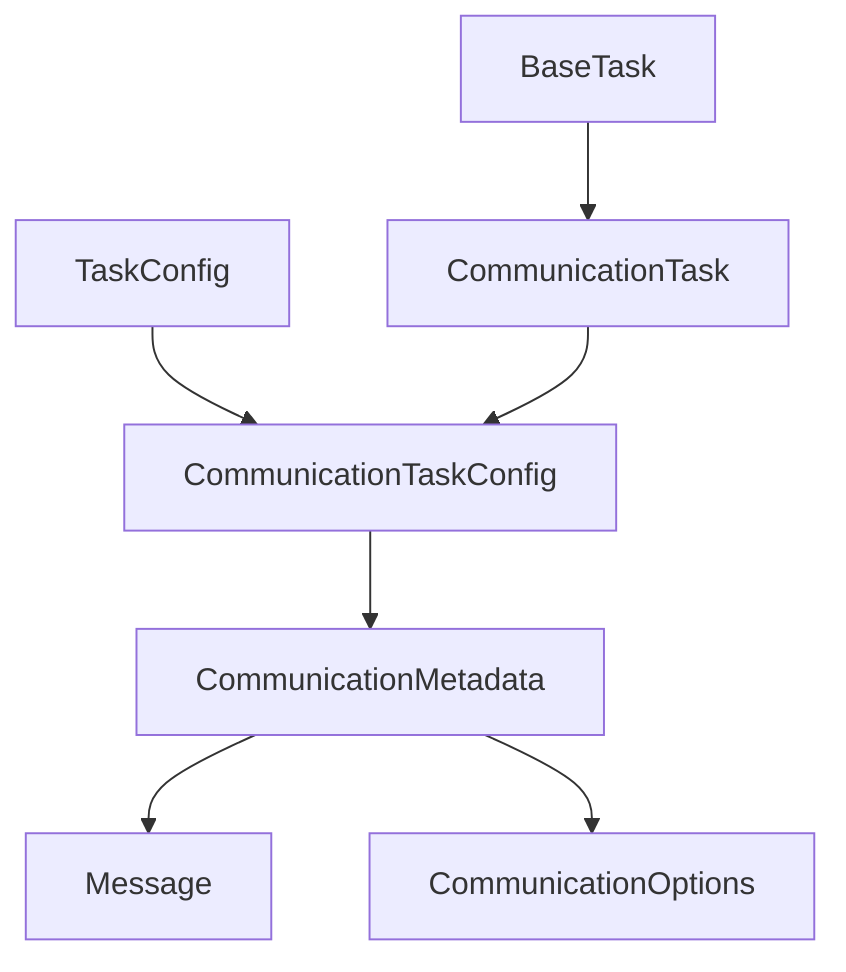
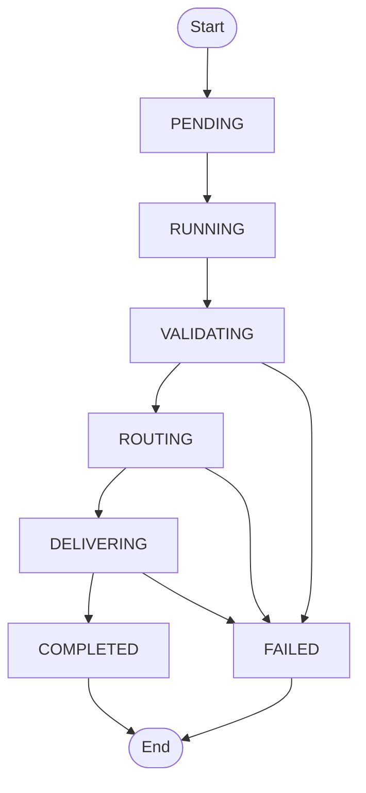
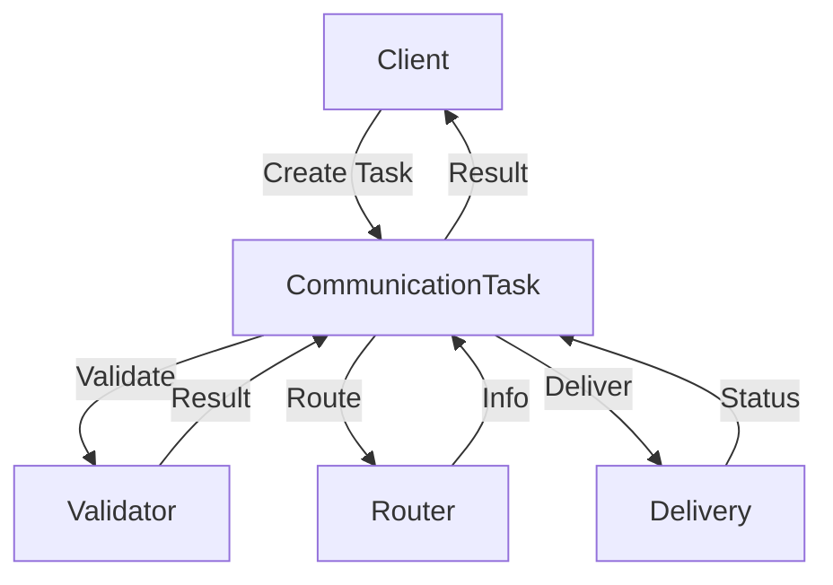
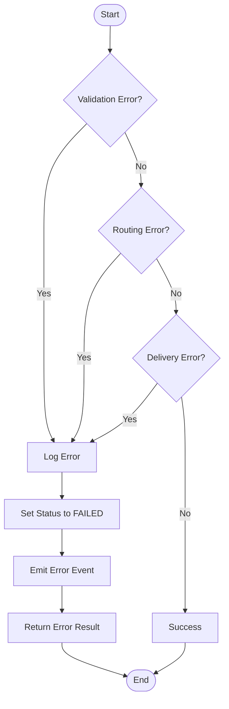
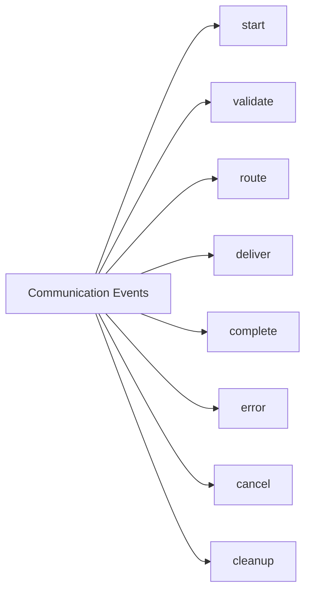

# Communication Task Documentation

## Overview

The communication task system provides a robust framework for handling various types of communication operations in the orchestrator, including message routing, validation, and delivery.

## Architecture



## Task Lifecycle



## Communication Flow



## Error Handling



## Configuration

### CommunicationTaskConfig

```typescript
interface CommunicationTaskConfig {
  type: TaskType.COMMUNICATION;
  metadata: {
    operation: 'send' | 'receive' | 'broadcast';
    message: {
      id: string;
      type: string;
      content: any;
      headers: Record<string, string>;
    };
    target: string;
    options?: {
      timeout?: number;
      retries?: number;
      encryption?: boolean;
      compression?: boolean;
      priority?: number;
    };
  };
}
```

## Event System



## Usage Example

```typescript
// Create a communication task
const task = new CommunicationTask({
  id: 'comm-1',
  type: TaskType.COMMUNICATION,
  priority: 1,
  metadata: {
    operation: 'send',
    message: {
      id: 'msg-1',
      type: 'notification',
      content: { text: 'Hello World' },
      headers: { 'content-type': 'application/json' }
    },
    target: 'user-123',
    options: {
      encryption: true,
      compression: true,
      timeout: 5000
    }
  }
});

// Execute the task
const result = await task.execute();
```

## Best Practices

1. **Message Validation**
   - Validate message format and content before processing
   - Check message size and type constraints
   - Verify required headers and metadata

2. **Error Handling**
   - Handle network errors gracefully
   - Implement retry mechanisms for transient failures
   - Log detailed error information for debugging

3. **Security**
   - Always encrypt sensitive messages
   - Validate message sources and targets
   - Implement rate limiting and access control

4. **Performance**
   - Use compression for large messages
   - Implement message queuing for high load
   - Monitor message delivery times

5. **Monitoring**
   - Track message delivery success rates
   - Monitor system resource usage
   - Log important communication events

6. **Configuration**
   - Set appropriate timeouts for different operations
   - Configure retry policies based on message type
   - Use priority levels for message routing 